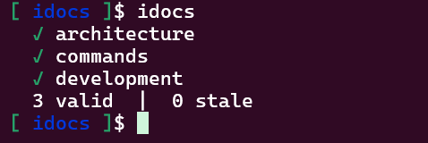
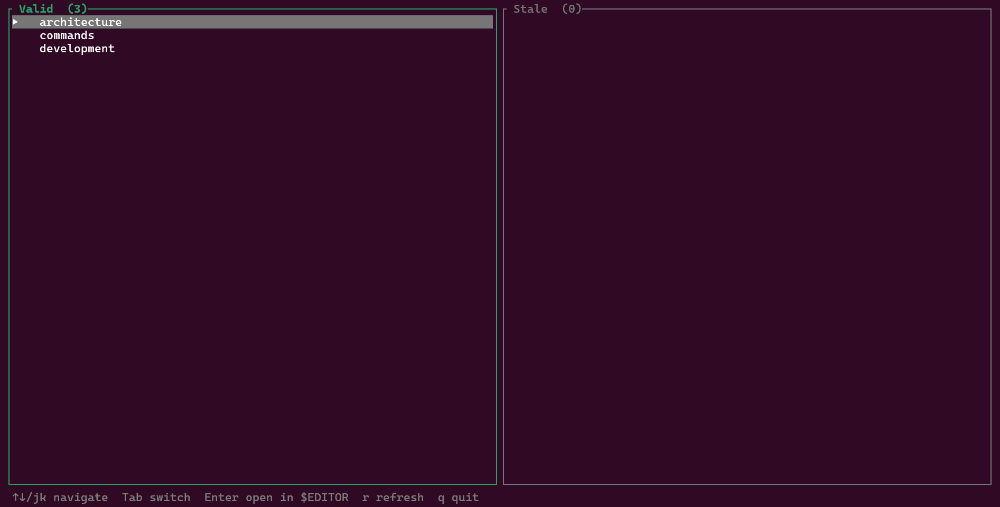
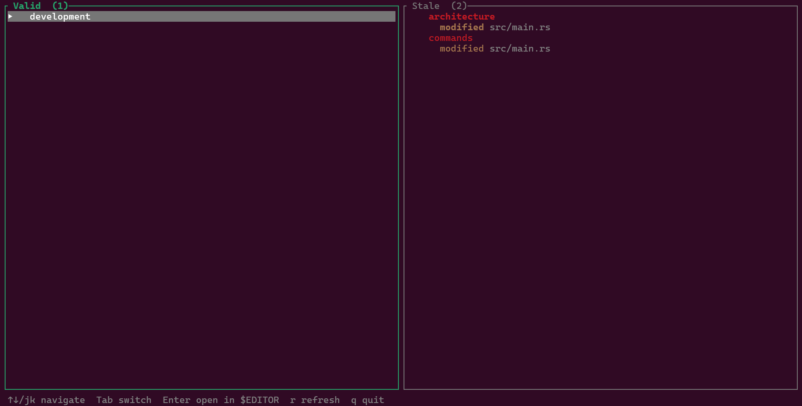

# 📝 idocs

CLI tool that detects when your markdown docs become stale relative to source files.

Track which source files your documentation references. When a source changes,
idocs flags the doc as stale — re-hash after review to acknowledge it's up to date.

---

## examples

### cli



### tui



### tui after editing main.rs




## Install

```sh
# install directly from git
cargo install --git https://github.com/gmars1/idocs

# or clone and install from path
git clone https://github.com/gmars1/idocs && cd idocs
cargo install --path .
```

## Quick start

```
idocs init
idocs add auth src/auth.rs src/login.rs   # register doc
idocs                                      # check all
idocs -i                                   # TUI mode
```

## Commands

`idocs` — check all docs, show valid/stale<br>
`idocs <file>` — filter docs tracking a specific source file<br>
`idocs init` — initialize `.idocs` directory<br>
`idocs add <name> <sources...>` — register a doc tracking source files<br>
`idocs rm <name>` — remove a doc<br>
`idocs info <name>` — doc details with source status<br>
`idocs up <name>` — re-hash sources after review<br>
`idocs stale` — list only stale docs<br>
`idocs read <name>` — print doc content<br>
`idocs edit <name> --set "..."` — replace entire doc content<br>
`idocs edit <name> --lines N-M --text "..."` — replace a range of lines<br>
`idocs edit <name> --replace "x" --with "y"` — find-and-replace<br>
`idocs edit <name> --rehash` — update source hashes after editing<br>
`idocs edit <name>` (stdin pipe) — read new content from stdin<br>
`idocs -i` — interactive TUI (two-panel viewer)<br>
`idocs --json` — machine-readable output


